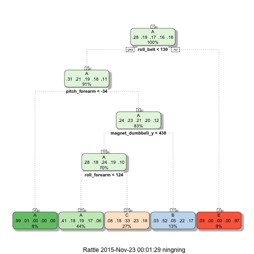
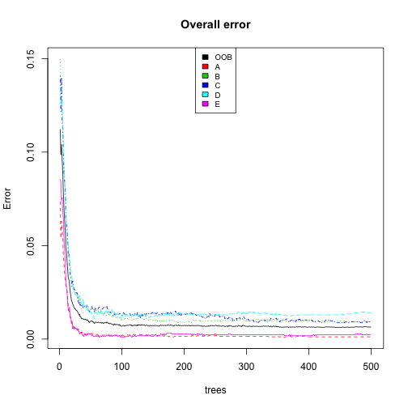
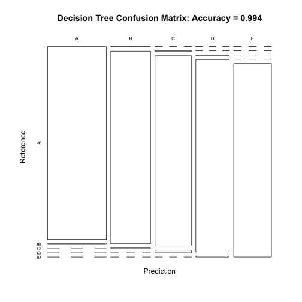
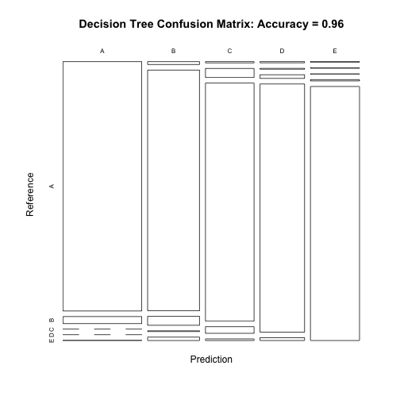
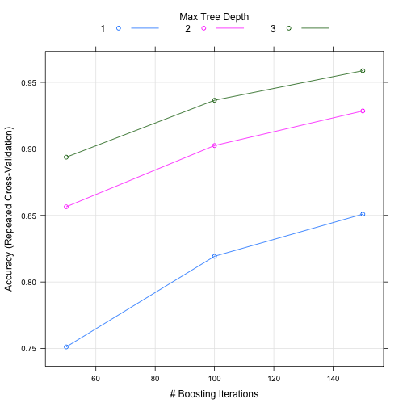

#Peer Assessment


By Ning Ning

This assignment makes use of data measured by accelerometers on the belt, forearm, 
arm and dumbell of 6 participants while they were doing barbell lifts. They were asked to perform
barbell lifts correctly and incorrectly in 5 different ways. The goal of this project is to quantify how well they do it. 
The data for this project come from this source: http://groupware.les.inf.puc-rio.br/har. 

###Data Analysis

The 6 participants were asked to perform one set of 10 repetitions of the Unilateral Dumbbell Biceps Curl in five different fashions ("class" in dataset): exactly according to the specification (Class A), throwing the elbows to the front (Class B), lifting the dumbbell only halfway (Class C), lowering the dumbbell only halfway (Class D) and throwing the hips to the front (Class E). Class A corresponds to the specified execution of the exercise, while the other 4 classes correspond to common mistakes. The goal of this project is to predict the manner in which they did the lifting.

1.Load the data and libraries:


```r
library(caret)
library(rpart)
library(randomForest)
library(ggplot2)
library(knitr)
library(rattle)
setwd("~/r/pml")
url<-"https://d396qusza40orc.cloudfront.net/predmachlearn/pml-training.csv"
download.file(url,destfile="pml-training.csv",method="curl")
url<-"https://d396qusza40orc.cloudfront.net/predmachlearn/pml-testing.csv"
download.file(url,destfile="pml-testing.csv",method="curl")
train<-read.csv("pml-training.csv",na.strings=c("NA","#DIV/0!",""))
test<-read.csv("pml-testing.csv",na.strings=c("NA","#DIV/0!",""))
```

2.Data Partitioning

The training dataset will be partitioned into two parts: 60% goes to training set, 40% goes to testing set.


```r
int<-createDataPartition(train$classe,p=0.6,list=FALSE)
dtrain<-train[int,]
dtest<-train[-int,]
dim(dtrain);dim(dtest)
```

```
## [1] 11776   160
```

```
## [1] 7846  160
```

3.Data Cleaning

In order to increase the accuracy of the prediction model, data should be cleaned before the fitting procedure: 

+ Exclude the predictors which are not useful in the prediction model (such as X, user_name, raw_timestamp_part_1, raw_timestamp_part_2, cvtd_timestamp, new_window, num_window):


```r
dtrain<-dtrain[,-c(1:7)]
dim(dtrain)
```

```
## [1] 11776   153
```

+ Exclude the predictors with near zero variance:


```r
dtint<-dtrain
nzv<-nearZeroVar(dtrain,saveMetrics=TRUE)
dtrain<-dtrain[,nzv$nzv==FALSE]
dtrain$classe<-dtint$classe
dim(dtrain)
```

```
## [1] 11776   126
```

+ Exclude the predictors with more than 60% NAs:


```r
dt<-dtrain
vec<-numeric(1)
n=0
for (i in 1:ncol(dt)) {
  if (sum(is.na(dtrain[,i])) / nrow(dtrain) > 0.6) {
    n=n+1
    vec[n] <- i
  }
}
for (i in n) {
   dtrain<-dtrain[,-vec]
}

int<-colnames(dtrain)
dtest<-dtest[int]
dim(dtrain);dim(dtest)
```

```
## [1] 11776    53
```

```
## [1] 7846   53
```

+ Clean test dataset accordingly:


```r
int<-colnames(dtrain[,-53])
test<-test[int]
dim(test)
```

```
## [1] 20 52
```

###Prediction Model

Three method will be employed in this project to make prediction: Decision trees, random forests and generalized boosted regression.

+ Prediction Model with Decision Trees Method


```r
set.seed(31415)
fit1<-train(classe~.,data=dtrain,method="rpart")
print(fit1)
```

```
## CART 
## 
## 11776 samples
##    52 predictor
##     5 classes: 'A', 'B', 'C', 'D', 'E' 
## 
## No pre-processing
## Resampling: Bootstrapped (25 reps) 
## Summary of sample sizes: 11776, 11776, 11776, 11776, 11776, 11776, ... 
## Resampling results across tuning parameters:
## 
##   cp          Accuracy   Kappa       Accuracy SD  Kappa SD  
##   0.03322259  0.5149203  0.36880622  0.04094405   0.06481055
##   0.06027527  0.4026782  0.18660980  0.05898676   0.09792315
##   0.11865211  0.3397841  0.08561073  0.04043403   0.06001906
## 
## Accuracy was used to select the optimal model using  the largest value.
## The final value used for the model was cp = 0.03322259.
```

```r
fancyRpartPlot(fit1$finalModel)
```

 

Now, we test this model with test dataset:


```r
test1<-predict(fit1,newdata=dtest)
cm1<-confusionMatrix(test1,dtest$classe)
print(cm1)
```

```
## Confusion Matrix and Statistics
## 
##           Reference
## Prediction    A    B    C    D    E
##          A 1995  641  634  579  199
##          B   36  504   35  236  205
##          C  164  373  699  471  376
##          D    0    0    0    0    0
##          E   37    0    0    0  662
## 
## Overall Statistics
##                                           
##                Accuracy : 0.492           
##                  95% CI : (0.4808, 0.5031)
##     No Information Rate : 0.2845          
##     P-Value [Acc > NIR] : < 2.2e-16       
##                                           
##                   Kappa : 0.3364          
##  Mcnemar's Test P-Value : NA              
## 
## Statistics by Class:
## 
##                      Class: A Class: B Class: C Class: D Class: E
## Sensitivity            0.8938  0.33202  0.51096   0.0000  0.45908
## Specificity            0.6343  0.91909  0.78635   1.0000  0.99422
## Pos Pred Value         0.4928  0.49606  0.33557      NaN  0.94707
## Neg Pred Value         0.9376  0.85154  0.88391   0.8361  0.89086
## Prevalence             0.2845  0.19347  0.17436   0.1639  0.18379
## Detection Rate         0.2543  0.06424  0.08909   0.0000  0.08437
## Detection Prevalence   0.5159  0.12949  0.26549   0.0000  0.08909
## Balanced Accuracy      0.7641  0.62555  0.64866   0.5000  0.72665
```

We obtain 48.5% of accuracy which is quite low. It seems that this method is probably not the optimal. So we proceed to the second method, which is random forest method. 


+ Prediction Model with Random Forests Method


```r
set.seed(31415)
fit2<-randomForest(classe~.,data=dtrain)
print(fit2)
```

```
## 
## Call:
##  randomForest(formula = classe ~ ., data = dtrain) 
##                Type of random forest: classification
##                      Number of trees: 500
## No. of variables tried at each split: 7
## 
##         OOB estimate of  error rate: 0.65%
## Confusion matrix:
##      A    B    C    D    E class.error
## A 3344    3    0    1    0 0.001194743
## B   17 2258    4    0    0 0.009214568
## C    0   16 2035    3    0 0.009250243
## D    1    0   24 1903    2 0.013989637
## E    0    0    1    4 2160 0.002309469
```

```r
plot(fit2,main = "Overall error")
legend("top",colnames(fit2$err.rate),col=1:6,cex=0.8,fill=1:6)
```

 

As we are using the out-of-bag error estimate, we do not need a cross validation set aside test set. The OOB estimate of error rate is 0.57%, which suggests that the model has 99.43% out of sample accuracy for the traning set. We can see from the overall error plot that the prediction error between classes is veryquite balanced.

Now, we test this model with test dataset:


```r
test2<-predict(fit2,newdata=dtest)
cm2<-confusionMatrix(test2,dtest$classe)
print(cm2)
```

```
## Confusion Matrix and Statistics
## 
##           Reference
## Prediction    A    B    C    D    E
##          A 2229    9    0    0    0
##          B    3 1504    6    0    0
##          C    0    5 1360   19    0
##          D    0    0    2 1267    6
##          E    0    0    0    0 1436
## 
## Overall Statistics
##                                           
##                Accuracy : 0.9936          
##                  95% CI : (0.9916, 0.9953)
##     No Information Rate : 0.2845          
##     P-Value [Acc > NIR] : < 2.2e-16       
##                                           
##                   Kappa : 0.9919          
##  Mcnemar's Test P-Value : NA              
## 
## Statistics by Class:
## 
##                      Class: A Class: B Class: C Class: D Class: E
## Sensitivity            0.9987   0.9908   0.9942   0.9852   0.9958
## Specificity            0.9984   0.9986   0.9963   0.9988   1.0000
## Pos Pred Value         0.9960   0.9941   0.9827   0.9937   1.0000
## Neg Pred Value         0.9995   0.9978   0.9988   0.9971   0.9991
## Prevalence             0.2845   0.1935   0.1744   0.1639   0.1838
## Detection Rate         0.2841   0.1917   0.1733   0.1615   0.1830
## Detection Prevalence   0.2852   0.1928   0.1764   0.1625   0.1830
## Balanced Accuracy      0.9985   0.9947   0.9952   0.9920   0.9979
```

```r
plot(cm2$table, col = cm2$byClass, main = paste("Decision Tree Confusion Matrix: Accuracy =", round(cm2$overall['Accuracy'],3)))
```

 

We obtain 99.4% of accuracy, which is quite good. We proceed to the third method, which is generalized boosted regression method, to see if we can get even better prediction. 

+ Prediction Model with Generalized Boosted Regression Method


```r
set.seed(31415)
control<-trainControl(method="repeatedcv",number=5,repeats=1)
fit3<-train(classe~.,data=dtrain,method="gbm",trControl=control,verbose=FALSE)
print(fit3)
```

```
## Stochastic Gradient Boosting 
## 
## 11776 samples
##    52 predictor
##     5 classes: 'A', 'B', 'C', 'D', 'E' 
## 
## No pre-processing
## Resampling: Cross-Validated (5 fold, repeated 1 times) 
## Summary of sample sizes: 9420, 9421, 9421, 9422, 9420 
## Resampling results across tuning parameters:
## 
##   interaction.depth  n.trees  Accuracy   Kappa      Accuracy SD
##   1                   50      0.7511884  0.6845308  0.003400685
##   1                  100      0.8192926  0.7713328  0.010271973
##   1                  150      0.8509676  0.8114062  0.007470112
##   2                   50      0.8564857  0.8181953  0.009994654
##   2                  100      0.9025126  0.8766341  0.006204771
##   2                  150      0.9284983  0.9095338  0.002671827
##   3                   50      0.8937658  0.8655137  0.005029946
##   3                  100      0.9365654  0.9197493  0.002977809
##   3                  150      0.9587289  0.9477893  0.004140667
##   Kappa SD   
##   0.004484626
##   0.012915753
##   0.009363302
##   0.012515623
##   0.007815934
##   0.003395374
##   0.006359733
##   0.003762461
##   0.005239556
## 
## Tuning parameter 'shrinkage' was held constant at a value of 0.1
## 
## Tuning parameter 'n.minobsinnode' was held constant at a value of 10
## Accuracy was used to select the optimal model using  the largest value.
## The final values used for the model were n.trees = 150,
##  interaction.depth = 3, shrinkage = 0.1 and n.minobsinnode = 10.
```

Now,we test this model with test dataset:


```r
test3<-predict(fit3,newdata=dtest)
cm3<-confusionMatrix(test3,dtest$classe)
print(cm3)
```

```
## Confusion Matrix and Statistics
## 
##           Reference
## Prediction    A    B    C    D    E
##          A 2199   62    0    0    2
##          B   17 1400   52    4   20
##          C    7   49 1297   36    9
##          D    6    4   18 1239   14
##          E    3    3    1    7 1397
## 
## Overall Statistics
##                                           
##                Accuracy : 0.96            
##                  95% CI : (0.9554, 0.9642)
##     No Information Rate : 0.2845          
##     P-Value [Acc > NIR] : < 2.2e-16       
##                                           
##                   Kappa : 0.9494          
##  Mcnemar's Test P-Value : 2.366e-10       
## 
## Statistics by Class:
## 
##                      Class: A Class: B Class: C Class: D Class: E
## Sensitivity            0.9852   0.9223   0.9481   0.9635   0.9688
## Specificity            0.9886   0.9853   0.9844   0.9936   0.9978
## Pos Pred Value         0.9717   0.9377   0.9278   0.9672   0.9901
## Neg Pred Value         0.9941   0.9814   0.9890   0.9928   0.9930
## Prevalence             0.2845   0.1935   0.1744   0.1639   0.1838
## Detection Rate         0.2803   0.1784   0.1653   0.1579   0.1781
## Detection Prevalence   0.2884   0.1903   0.1782   0.1633   0.1798
## Balanced Accuracy      0.9869   0.9538   0.9663   0.9785   0.9833
```

```r
plot(cm3$table, col = cm3$byClass, main = paste("Decision Tree Confusion Matrix: Accuracy =", round(cm3$overall['Accuracy'],3)))
```

 

```r
plot(fit3)
```

 

We obtain 96.2% of accuracy. We can see from the resampling profile plot that the estimates of performance and the tuning parameters are not quite balanced. 

###Conclusion

Based on the accuracy of the model on the test set, we choose the highest one which is provided by the model with random forest method. We therefore employ this method to predict the 20 testing sets.


```r
prediction<-predict(fit2, newdata=test, type="class")
prediction
```

```
##  1  2  3  4  5  6  7  8  9 10 11 12 13 14 15 16 17 18 19 20 
##  B  A  B  A  A  E  D  B  A  A  B  C  B  A  E  E  A  B  B  B 
## Levels: A B C D E
```
